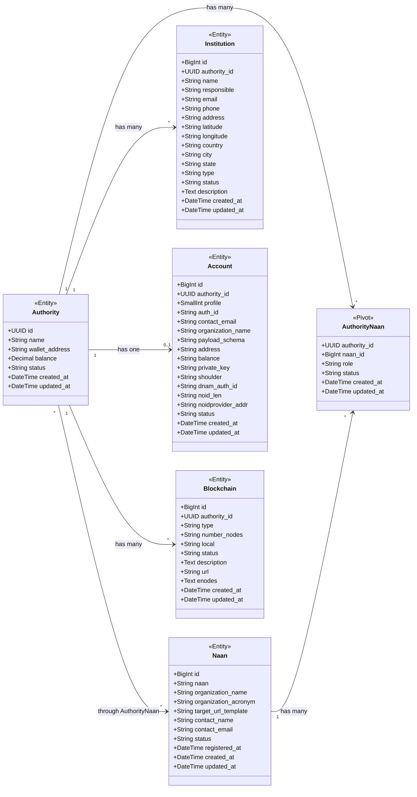

# Authority-First Architecture — dARK Dashboard

```mermaid
classDiagram
    direction LR

    class Authority {
        <<Entity>>
        +UUID id
        +String name
        +String wallet_address
        +Decimal balance
        +String status
        +DateTime created_at
        +DateTime updated_at
    }

    class Naan {
        <<Entity>>
        +BigInt id
        +String naan
        +String organization_name
        +String organization_acronym
        +String target_url_template
        +String contact_name
        +String contact_email
        +String status
        +DateTime registered_at
        +DateTime created_at
        +DateTime updated_at
    }

    class AuthorityNaan {
        <<Pivot>>
        +UUID authority_id
        +BigInt naan_id
        +String role
        +String status
        +DateTime created_at
        +DateTime updated_at
    }

    class Institution {
        <<Entity>>
        +BigInt id
        +UUID authority_id
        +String name
        +String responsible
        +String email
        +String phone
        +String address
        +String latitude
        +String longitude
        +String country
        +String city
        +String state
        +String type
        +String status
        +Text description
        +DateTime created_at
        +DateTime updated_at
    }

    class Account {
        <<Entity>>
        +BigInt id
        +UUID authority_id
        +SmallInt profile
        +String auth_id
        +String contact_email
        +String organization_name
        +String payload_schema
        +String address
        +String balance
        +String private_key
        +String shoulder
        +String dnam_auth_id
        +String noid_len
        +String noidprovider_addr
        +String status
        +DateTime created_at
        +DateTime updated_at
    }

    class Blockchain {
        <<Entity>>
        +BigInt id
        +UUID authority_id
        +String type
        +String number_nodes
        +String local
        +String status
        +Text description
        +String url
        +Text enodes
        +DateTime created_at
        +DateTime updated_at
    }

    Authority "1" --> "*" AuthorityNaan : has many
    Naan "1" --> "*" AuthorityNaan : has many
    Authority "*" --> "*" Naan : through AuthorityNaan
    Authority "1" --> "*" Institution : has many
    Authority "1" --> "0..1" Account : has one
    Authority "1" --> "*" Blockchain : has many
```
